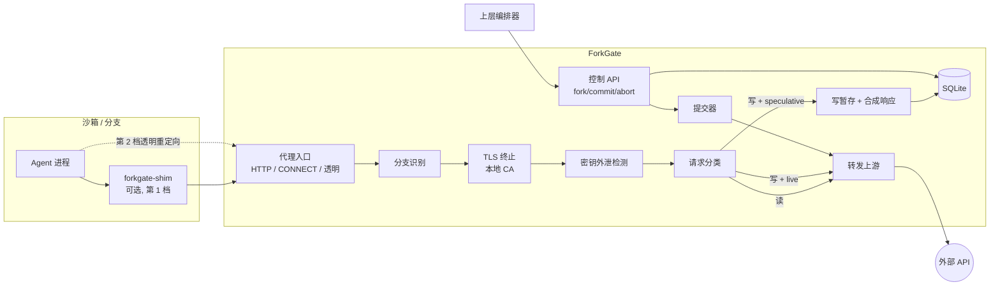

# ForkGate：分支感知的沙箱出网网关 · 规划执行蓝图

> 文档状态：草案 v0.1  
> 更新日期：2026-09-28  
> 仓库：[yushui2022/ForkGate](https://github.com/yushui2022/ForkGate)

## 1. 一句话定位

ForkGate 是挂在沙箱出网路径上的独立网关。沙箱被 fork 成多个分支后，ForkGate 让每个分支都能“以为自己在正常访问外部世界”：读请求照常返回，写请求被暂存并返回合成响应；等上层选出胜出分支，只把它暂存的写请求真正发出去，落选分支的副作用全部丢弃。同时它检查每个外发请求，发现已登记的密钥（含 base64 等编码形式）流向未授权目的地就拦截。

ForkGate 不做沙箱、不做 fork、不做编排。它只回答一个问题：多个平行分支和一个不能回滚的外部世界之间，谁的副作用算数。

## 2. 为什么做

### 2.1 问题

沙箱厂商已经能在毫秒级 fork 文件系统和内存（E2B、Daytona、Morph、DeltaBox），但网络和外部世界没法 fork：

1. 3 个分支从同一个 checkpoint 出发，每个都会创建 issue、发邮件、写数据库，外部世界收到 3 份副作用。
2. 回滚沙箱只回滚了沙箱内部，已经发出去的请求收不回来。
3. fork 时快照里带着的连接、凭证、身份被原样复制，分支之间身份混淆。
4. 分支里的 agent 可能被 prompt injection 诱导，把密钥编码后外发，现有沙箱出网策略大多只看域名。

应用层方案（culpa、agent-ledger 等）需要改 agent 代码或接入 SDK。ForkGate 放在网络层，对 agent 透明，任何语言、任何工具调用都能覆盖。

### 2.2 理论根基

- Speculator（Nightingale 等，SOSP 2005）：推测执行，内部状态可以先跑，失败就回滚。
- Rethink the Sync（Nightingale 等，OSDI 2006）：external synchrony / output commit。内部可以推测，对外可见的输出必须等确定之后才放出去。
- Safe to Resume?（arXiv 2608.29381，2026）：证明“正确回滚”不等于“安全恢复”，恢复后的执行可能与外部副作用组成一段从未合法存在过的历史。

ForkGate 把 output commit 思想用到“多分支 agent 探索”上：分支内部随便推测，对外的写操作按分支暂存，只有胜出分支的输出被提交。

## 3. 范围与非目标

### 3.1 ForkGate 负责

| 能力 | 说明 |
|---|---|
| 分支身份 | 判断每个外发请求来自哪个分支，fork 后身份不混淆 |
| 请求分类 | 区分读（可直接放行）和写（有副作用，需暂存） |
| 写暂存 | 推测态分支的写请求不发出，保存下来并返回合成响应 |
| 提交与丢弃 | 胜出分支的暂存写按顺序真正发出；落选分支丢弃 |
| 密钥外泄检测 | 检查外发请求是否带着已登记密钥（原文或编码形式），命中即拦截 |
| 事件记录 | 每个请求、暂存、提交、拦截都有结构化事件，可查询 |

### 3.2 明确不做

1. 不做沙箱运行时，不做文件系统或内存 fork。fork 由 E2B、Daytona、Docker 等后端完成，ForkGate 只登记分支关系。
2. 不做 agent 编排，不决定哪个分支胜出。胜者由上层（你的脚本、LangGraph 等）选出后调用 commit。
3. 不承诺拦住所有外泄。密钥检测针对的是“粗心”或“被注入后的简单外泄”，挡不住加密、分片、多请求拼接等刻意对抗。文档和 README 都要写清楚这一点。
4. 第一阶段只处理 HTTP/HTTPS。原始 TCP、UDP、DNS、WebSocket 默认按策略拦截或直通，不做暂存。
5. 不做 exactly-once。提交时用幂等键和进度记录尽量避免重复，但外部 API 不支持幂等时无法保证。

## 4. 核心概念

| 术语 | 含义 |
|---|---|
| Tree | 一次探索任务的分支树，根节点是最初的沙箱 |
| Branch | 树上的一个节点，对应一个正在运行（或已冻结）的沙箱 |
| Live 分支 | 写请求直接发出，和普通代理一样 |
| Speculative 分支 | 推测态，写请求被暂存 |
| Sealed 分支 | 已被 fork 冻结的节点，不能再发请求，只作为子分支的父节点 |
| StagedWrite | 被暂存的一个写请求，包含完整请求内容和当时返回的合成响应 |
| Synthetic Response | 返回给推测态分支的“假”响应，让 agent 能继续跑 |
| Placeholder | 合成响应里的假 ID（如假 issue 编号），提交时替换成真实 ID |
| Commit | 把胜出分支（及其祖先路径）的暂存写按顺序真正发出 |
| Divergent 标记 | 分支后续行为依赖了合成数据，结果可信度下降 |
| SecretRule | 一个已登记的密钥及其允许流向 |

分支有两个独立字段：`mode`（live / speculative）决定写请求怎么处理，`status`（active / sealed / committed / aborted）决定分支还能不能用。

```text
新建根分支           mode=live,        status=active
fork 产生的子分支    mode=speculative, status=active

active ──fork──────> sealed      （不再接受请求，只作为父节点）
active ──commit────> committed   （带 promote 时改为 mode=live, status=active）
active ──abort─────> aborted
sealed、committed、aborted 都不能再 fork
```

## 5. 总体架构



处理顺序固定为：识别分支 → 解密 TLS → 密钥检测 → 分类 → 放行或暂存。密钥检测放在分类之前，保证暂存的写请求在将来提交时也已经过检查。

ForkGate 对外有两个端口，必须分开：

| 端口 | 用途 | 谁能访问 |
|---|---|---|
| 数据面 `:3128`（显式代理）/ `:80,:443`（透明模式） | 沙箱的出网流量 | 只有持有分支 token 或已登记源 IP 的沙箱 |
| 控制面 `:7070` | fork / commit / abort / 查询 | 只有上层编排器（Bearer token） |

## 6. 分支身份：最容易做错的一环

### 6.1 为什么不能把身份放在沙箱里

如果分支 ID 写在沙箱的环境变量或文件里，fork 时会被原样复制，3 个子分支都拿着父分支的 ID。网关就分不清请求来自谁。

因此规则是：**身份由网关签发和判定；fork 时父身份立即作废，子分支拿到新身份。** 任何还在使用父身份的请求都能被识别出来。

### 6.2 第 1 档：显式代理 + shim（托管沙箱，如 E2B、Daytona）

```text
沙箱内：
  HTTPS_PROXY=http://127.0.0.1:3128
  forkgate-shim 监听 127.0.0.1:3128
    每建立一条上游连接时读取 /run/forkgate/token
    加上 Proxy-Authorization 后转发到 ForkGate 网关
```

fork 流程：

1. 编排器调用沙箱后端的 fork，得到 N 个新沙箱。
2. 编排器调用 `POST /v1/branches/{parent}/fork {count: N}`，网关把父分支置为 sealed，返回 N 个子 token。
3. 编排器通过沙箱后端的文件 API 把每个 token 写进对应子沙箱的 `/run/forkgate/token`。
4. 在第 3 步完成之前，子沙箱发出的请求还带着父 token。网关看到 sealed 分支的 token，返回 `503 + Retry-After: 1` 和错误码 `branch_sealed`。shim 收到后重读 token 文件并重试。

为什么要 shim，而不直接用 `HTTPS_PROXY=http://token@gateway`：环境变量在进程启动时就固定了，fork 后改不了。shim 每条新连接都重读文件，token 可以热更新。

还有一个隐患：HTTPS 走 CONNECT 隧道时，token 只在建隧道那一刻发送一次。如果 fork 发生时父分支有一条已建立的隧道，而后端的 fork 又复制了内存和连接状态，子分支可能沿用这条隧道，继续以父身份发请求。所以还要加一条规则：**分支被 seal 时，网关主动关闭该分支名下所有已建立的连接和隧道。** 客户端发现连接断开后重连，shim 就会读到新 token。fork 后连接在各家后端上的实际表现，见 §20 第 1 条。

shim 要足够小：一个静态编译的 Go 二进制，只做转发和加 header，不解密 TLS，不做判断。

### 6.3 第 2 档：透明代理（自己机器上的 Docker / netns）

每个容器有独立的 veth 和 IP，nftables 把容器的 80/443 出网流量重定向到网关，其余流量默认丢弃。身份按源 IP 判定：

1. 编排器创建子容器后，调用 `POST /v1/branches/{id}/identity {source_ip}` 登记。
2. 没登记的源 IP 一律拒绝。
3. 透明模式下 HTTPS 按 SNI 选择证书做 TLS 终止。

这一档 agent 绕不过去，但只能在自己控制网络的环境里用。

### 6.4 第 3 档：VM tap 网卡（后续）

在 Firecracker 等 VM 的 tap 设备上做和第 2 档一样的重定向，身份按 tap 设备或 MAC 判定。Phase 5 再做。

## 7. 请求分类

每个请求被分为四类之一：

| 类别 | 默认规则 | 在推测态分支中的处理 |
|---|---|---|
| `read` | GET、HEAD、OPTIONS | 转发上游，返回真实响应 |
| `write` | POST、PUT、PATCH、DELETE | 暂存，返回合成响应 |
| `passthrough` | 由 profile 声明 | 转发上游。用于“方法是 POST 但没有外部副作用”的请求 |
| `block` | 由策略声明 | 直接拒绝 |

`passthrough` 非常重要。LLM API（`POST /v1/chat/completions`）、搜索接口（`POST /_search`）、GraphQL 查询都是 POST，但 agent 需要真实结果才能继续工作。没有这一类，agent 在推测态几乎什么都做不了。

GraphQL 需要看 body：`query` 是读，`mutation` 是写。这由 GraphQL profile 解析。

未知的写请求默认暂存（安全的一侧），而不是放行。

## 8. 合成响应与占位符

这是整个项目最有研究味道的部分，也是最难做“完全正确”的部分。

### 8.1 合成响应的三个等级

| 等级 | 来源 | 效果 |
|---|---|---|
| L0 通用 | 无 profile | 返回 `202 Accepted`，body `{}`，header `X-ForkGate-Staged: <staged_id>` |
| L1 Profile | profile 模板 | 按 API 真实格式造响应，比如 GitHub 建 issue 返回 201 和带 `number` 的 JSON |
| L2 记录回放 | 同一请求在别处的真实响应 | 以后再做，第一阶段不做 |

L0 能让不太检查响应的脚本继续跑，但很多 SDK 会因为缺字段报错。所以第一批 profile（GitHub、Slack、通用 webhook）直接决定 demo 能不能跑通。

### 8.2 占位符

合成响应里的 ID 都是假的。ForkGate 给它们分配可识别的占位值：

- 整数 ID：从保留区间分配，如 `9000000001`、`9000000002`，按树唯一。
- 字符串 ID：`fgph_<短随机串>`。

每个占位值都记录在 `placeholders` 表里，关联到产生它的 StagedWrite 和提取路径（如 `$.number`）。

### 8.3 分支继续使用占位值时

agent 拿到假 issue 编号后，常常会接着用它：

- **后续写请求引用占位值**（比如给 issue 9000000001 加评论）：照常暂存，并记录依赖关系。提交时先发出第一个写，拿到真实编号，再替换后面请求里的占位值。
- **后续读请求引用占位值**（比如 `GET /issues/9000000001`）：上游不存在这个资源。profile 能造就返回合成数据，不能造就返回 404。两种情况都给分支加一个 divergent 标记。

### 8.4 Divergent 标记

分支只要读到过合成数据，它之后的推理就建立在“假设写成功了”的前提上。ForkGate 不试图判断这个假设是否成立，只负责如实记录：

```text
branch.divergent_count      读取合成数据的次数
branch.divergent_events     具体是哪些请求
```

上层选胜者时可以参考这个标记。commit 报告里也会列出来。

已知的局限：如果 agent 写入 A 之后再用一个不含占位值的请求读 A（比如列出所有 issue），网关识别不出这是“读自己的写”。这在 §19 风险里单独列出。

## 9. 提交语义

### 9.1 提交哪些写

提交的对象是一个叶子分支。实际发出的是从根到这个叶子整条路径上所有暂存的写，按时间顺序：

```text
root(live)
 └─ A (sealed，封存前暂存了 w1)
     ├─ B (speculative，暂存 w2, w3)   ← commit B
     └─ C (speculative，暂存 w4)
```

commit B 时依次发出 w1、w2、w3。C 以及路径上所有节点的其他子孙会被自动 abort，因为它们代表另一段历史。

根分支在第一次 fork 前通常是 live，写请求当场就发出了，不需要提交。

### 9.2 提交器流程

```text
对路径上每个 StagedWrite，按顺序：
  1. 用已解析的真实值替换请求里的占位符
  2. 解密暂存的请求内容（暂存记录加密落盘，见 §10.7）
  3. 如果 profile 声明 API 支持幂等键，加上 Idempotency-Key = staged_id
  4. 状态置为 sending 并落盘
  5. 发出请求
  6. 成功：记录真实响应，按 extract 规则提取真实 ID，状态 succeeded
     失败（明确的 4xx/5xx）：状态 failed，停止提交，整体状态 partial
     超时或连接中断：状态 unknown，停止提交
```

### 9.3 失败与恢复

- **partial**：前面已成功的写不会撤销（外部世界本来就撤不回），报告里列出成功到哪一步。修正后调用 commit 可以从失败处继续。
- **unknown**：不知道对方有没有收到。不支持幂等键的 API 不自动重试，必须人工调用 `resolve` 标成 succeeded 或 failed 后才能继续。
- **网关崩溃**：重启时把所有 `sending` 状态改为 `unknown`。

### 9.4 dry-run

`commit {dry_run: true}` 不发任何请求，只返回“将要发出的完整请求列表”（占位符已替换，已登记密钥显示为 `{{secret:NAME}}`，敏感 header 打码）。这适合在提交前人工审核，也适合写进 demo。

### 9.5 promote

commit 时可以带 `promote: true`，提交后胜出分支转为 live，之后的写直接发出。默认不 promote，分支进入 committed 终态。

## 10. 密钥外泄检测（SecretGuard）

### 10.1 定位

SecretGuard 是一根绊线，不是 DLP 系统。它能抓住的是：agent 粗心把密钥发错地方，或者被 prompt injection 诱导后用常见手法（原文、base64、hex、URL 编码）外发。它挡不住加密、分片、逐字符外发等刻意对抗（见 §10.8）。这一点必须写进 README。

它不依赖分支功能，单独启用也有用。所以它是第一个可发布的功能（Phase 1）。

### 10.2 登记密钥

```http
POST /v1/secrets
{
  "name": "GITHUB_TOKEN",
  "value": "ghp_xxxxxxxxxxxxxxxxxxxx",
  "allow": [
    {"host": "api.github.com", "locations": ["header:Authorization"]}
  ],
  "action": "block"
}
```

- `allow`：这个密钥合法的去处。host 支持 `*.example.com` 通配；`locations` 可选，限制只能出现在某个 header 里。上面的规则意味着：把 token 放进 GitHub 的请求 body（比如写进一个 gist）也会被拦。
- `action`：`block`（默认）或 `flag`（放行但记事件）。
- 编排器往沙箱注入了哪些密钥，就登记哪些。这是它最清楚的信息。

### 10.3 匹配什么：9 种编码形式

每个密钥登记时预先生成以下模式：

| 模式 | 数量 | 说明 |
|---|---|---|
| 原文 | 1 | 字节精确匹配 |
| 标准 base64 | 3 | 3 种字节偏移各一个，见 §10.4 |
| base64url | 3 | 把 `+/` 换成 `-_`，同样 3 种偏移 |
| hex 小写 / 大写 | 2 | hex 是逐字节编码，没有偏移问题 |

可选配置 `encode_depth: 2` 再加 base64 套 base64 的变体，默认关闭。

### 10.4 base64 为什么要 3 种偏移

base64 把每 3 个字节编码成 4 个字符，分组边界由整段数据决定。密钥嵌在更长的内容里（比如 `{"k":"<密钥>"}` 整体被 base64），它前面有多少字节，决定了它的编码长什么样。直接拿 `base64(密钥)` 去搜，只有前面字节数恰好是 3 的倍数时才能搜到。

解法：对偏移 p = 0、1、2 各生成一个模式。

```text
variant(p):
  enc = base64(p 个 0x00 + 密钥)
  如果 p > 0：丢掉第一个 4 字符组（它混入了占位字节）
  丢掉末尾不完整的组（它依赖密钥后面的未知字节）
  剩下的就是这个偏移下一定会出现的子串
```

密钥在原文中的偏移为 k 时，p = k mod 3 的那个模式一定是编码结果的子串。3 个模式覆盖全部情况。

代价是会丢掉密钥首尾各几个字节的信息，所以密钥短于 12 字节时只做原文匹配，并在登记时返回警告。12 字节时最短的模式也有 12 个 base64 字符（72 位），误报概率可以忽略。

这个算法必须有属性测试（§17.1）：随机密钥、随机前后缀，整体编码后断言一定能检出。

### 10.5 扫描哪里、怎么扫

扫描范围：请求行（URL 路径和 query）、所有 header、body。

扫描前的规范化，每一种生成一个视图，模式在每个视图上都跑一遍：

1. 原始字节。
2. 按 `Content-Encoding` 解压后的 body（gzip、deflate、br）。
3. URL 和 `application/x-www-form-urlencoded` body 做百分号解码后的视图。
4. JSON body 做反转义后的视图（处理 `\/`、`\u00xx` 这类转义把 base64 字符拆开的情况）。
5. 去掉 `\r\n` 的视图（MIME 风格的 base64 每 76 个字符换一次行，会把模式截断）。

匹配引擎：所有密钥的所有模式放进同一个 Aho-Corasick 自动机，一遍扫描完成，复杂度和 body 大小成线性，和密钥数量基本无关。Go 生态有几个现成实现，Phase 1 选型时对比性能和维护状态，选定后锁定版本；数据量小时也可以先用 `bytes.Contains` 逐个匹配，接口不变。

大小限制：body 超过 `scan_max_bytes`（默认 10 MB）时，按 `oversize_action` 处理，默认 `block`。流式 body（chunked 上传）先缓冲到上限再判断。

### 10.6 命中之后

1. 检查目的地和位置是否在这个密钥的 `allow` 规则内。在，就放行，不记告警。
2. 不在，按 `action` 处理：
   - `block`：返回 `403`，body 为 `{"error":"forkgate_secret_blocked","secret":"GITHUB_TOKEN"}`。请求不会发出，也不会进入暂存。
   - `flag`：放行，记录 `secret.flagged` 事件。
3. 事件里只记录密钥名、命中的编码方式、位置（如 `body@offset 1024`）、目的地 host。**永远不记录密钥值，也不记录命中位置附近的原文。**

### 10.7 网关自身的密钥卫生

网关自己成了高价值目标：它存着所有登记的密钥，还存着暂存的完整请求（里面常有 Authorization header）。

- 登记的密钥：只在内存里保存编译好的模式；落盘时用主密钥加密。主密钥来自环境变量 `FORKGATE_MASTER_KEY`，不写进配置文件。
- 暂存请求：整条记录用同一主密钥做 AES-GCM 加密后落盘，查询 API 返回时对 `Authorization`、`Cookie`、`X-Api-Key` 等 header 打码。
- 日志：默认不记录 body，header 打码规则和查询 API 一致。
- 控制 API 不提供“读出密钥原值”的接口。

### 10.8 已知绕过（写进 README）

| 手法 | 能否检出 | 说明 |
|---|---|---|
| 原文 / base64 / base64url / hex | 能 | 本节的核心 |
| URL 编码、JSON 转义、gzip | 能 | §10.5 的规范化视图 |
| 双重 base64 | 可选 | `encode_depth: 2` |
| 先 gzip 再 base64（压缩后编码） | 不能 | 压缩改变了字节，模式失效。后续可加“对疑似 base64 的长串解码、遇到 gzip 魔数再解压”的视图，代价是扫描变慢 |
| 分片（每个请求发几个字符） | 不能 | 可在后续版本做“同一分支累计命中前缀”的启发式 |
| 加密、XOR、反转、自定义编码 | 不能 | 需要内核或进程级追踪，那是 ActPlane 这类方案的领域 |
| DNS 隧道、原始 TCP | 不适用 | 第 2 档默认只放行 80/443，其余丢弃，间接挡住 |

### 10.9 和分支功能的配合

- 暂存的写请求在入队前就已经过扫描，所以提交时不会发出带密钥的请求。
- 提交时再扫一次（占位符替换后内容变了），这一步不应命中；命中说明替换逻辑有 bug，记 `commit.secret_mismatch` 并停止提交。
- 每个分支的拦截次数会出现在 commit 报告里。一个被拦过外泄的分支，上层大概率不该选它当胜者。

## 11. 数据模型

存储用 SQLite（WAL 模式），单文件、零运维，足够支撑单机 MVP。表结构：

```sql
CREATE TABLE trees (
  tree_id      TEXT PRIMARY KEY,
  root_branch  TEXT NOT NULL,
  created_at   INTEGER NOT NULL
);

CREATE TABLE branches (
  branch_id        TEXT PRIMARY KEY,
  tree_id          TEXT NOT NULL REFERENCES trees(tree_id),
  parent_id        TEXT REFERENCES branches(branch_id),
  mode             TEXT NOT NULL,   -- live | speculative
  status           TEXT NOT NULL,   -- active | sealed | committed | aborted
  token_hash       TEXT,            -- 第 1 档：只存 token 的哈希
  source_ip        TEXT,            -- 第 2 档
  divergent_count  INTEGER NOT NULL DEFAULT 0,
  created_at       INTEGER NOT NULL,
  sealed_at        INTEGER
);

CREATE TABLE staged_writes (
  staged_id      TEXT PRIMARY KEY,
  branch_id      TEXT NOT NULL REFERENCES branches(branch_id),
  seq            INTEGER NOT NULL,  -- 分支内单调递增
  method         TEXT NOT NULL,
  host           TEXT NOT NULL,
  path           TEXT NOT NULL,
  request_blob   BLOB NOT NULL,     -- 完整请求，AES-GCM 加密
  synthetic_resp BLOB NOT NULL,
  profile        TEXT,
  status         TEXT NOT NULL,     -- staged | sending | succeeded | failed | unknown | discarded
  real_status    INTEGER,
  real_resp_blob BLOB,              -- 加密
  created_at     INTEGER NOT NULL,
  UNIQUE (branch_id, seq)
);

CREATE TABLE placeholders (
  placeholder  TEXT PRIMARY KEY,
  tree_id      TEXT NOT NULL,
  staged_id    TEXT NOT NULL REFERENCES staged_writes(staged_id),
  json_path    TEXT NOT NULL,       -- 如 $.number
  real_value   TEXT                 -- 提交后填入
);

CREATE TABLE secrets (
  name        TEXT PRIMARY KEY,
  value_blob  BLOB NOT NULL,        -- 加密
  allow_json  TEXT NOT NULL,
  action      TEXT NOT NULL,
  created_at  INTEGER NOT NULL
);

CREATE TABLE events (
  event_id    INTEGER PRIMARY KEY AUTOINCREMENT,
  tree_id     TEXT,
  branch_id   TEXT,
  type        TEXT NOT NULL,
  payload     TEXT NOT NULL,        -- JSON，已脱敏
  created_at  INTEGER NOT NULL
);
```

事件类型：

```text
branch.created  branch.forked  branch.sealed  branch.committed  branch.aborted
request.forwarded  request.passthrough  request.blocked
write.staged  write.sent  write.failed  write.unknown  write.discarded
synthetic.read          (分支读到了合成数据，divergent +1)
secret.blocked  secret.flagged
commit.started  commit.completed  commit.partial  commit.secret_mismatch
identity.stale          (sealed 分支的 token 还在发请求)
```

## 12. 控制 API

所有控制接口需要 `Authorization: Bearer <FORKGATE_ADMIN_TOKEN>`，默认只监听 `127.0.0.1`。

```text
POST   /v1/trees                          创建树和根分支，返回 root token
GET    /v1/trees/{tree_id}                整棵树的状态
POST   /v1/branches/{id}/fork             {count} → 父分支 sealed，返回 N 个子分支和 token
POST   /v1/branches/{id}/identity         {source_ip}，第 2 档登记
POST   /v1/branches/{id}/commit           {dry_run, promote} → 提交报告
POST   /v1/branches/{id}/abort            丢弃暂存写
POST   /v1/staged/{staged_id}/resolve     {status: succeeded|failed}，处理 unknown
GET    /v1/branches/{id}/staged           暂存写列表（已脱敏）
GET    /v1/branches/{id}/events           ?since=event_id
POST   /v1/secrets                        登记密钥
GET    /v1/secrets                        只返回名字和规则，不返回值
DELETE /v1/secrets/{name}
GET    /v1/ca.pem                         下载 CA 证书，注入沙箱用
GET    /healthz
GET    /metrics                           Prometheus 格式
```

commit 报告示例：

```json
{
  "branch_id": "br_b",
  "status": "completed",
  "path": ["br_root", "br_a", "br_b"],
  "writes": [
    {"staged_id": "sw_1", "method": "POST", "host": "api.github.com",
     "path": "/repos/o/r/issues", "status": "succeeded", "real_status": 201,
     "placeholders_resolved": {"9000000001": "4217"}},
    {"staged_id": "sw_2", "method": "POST", "host": "hooks.slack.com",
     "path": "/services/***", "status": "succeeded", "real_status": 200}
  ],
  "aborted_branches": ["br_c", "br_d"],
  "discarded_writes": 5,
  "divergent_count": 1,
  "secret_blocks": 0
}
```

## 13. Profile 系统

profile 用 YAML 声明，放在 `profiles/` 目录，用户可以自己加。一个 profile 描述一个 API 的分类规则、合成响应模板、提取规则和幂等键。

```yaml
# profiles/github.yaml
name: github
hosts: [api.github.com]
idempotency_header: null          # GitHub 不支持幂等键，unknown 时不自动重试
rules:
  - match: {method: POST, path: "/repos/{owner}/{repo}/issues"}
    class: write
    synthetic:
      status: 201
      body: |
        {"id": {{ph_int}}, "number": {{ph_int}}, "state": "open",
         "title": {{req.json.title}},
         "html_url": "https://github.com/{{path.owner}}/{{path.repo}}/issues/{{ph_ref $.number}}"}
    extract:
      - {placeholder: "$.number", real: "$.number"}
      - {placeholder: "$.id", real: "$.id"}
  - match: {method: POST, path: "/repos/{owner}/{repo}/issues/{number}/comments"}
    class: write
    synthetic: {status: 201, body: '{"id": {{ph_int}}}'}
  - match: {method: POST, path: "/graphql"}
    class: graphql                # 由内置解析器判断 query / mutation
```

```yaml
# profiles/llm.yaml：LLM 调用必须真实放行，否则 agent 无法工作
name: llm
hosts: [api.openai.com, api.anthropic.com, generativelanguage.googleapis.com]
rules:
  - match: {method: POST, path: "/**"}
    class: passthrough
```

上面的模板写法是示意语法，具体语法在 Phase 3 定稿。两个要求不能省：`ph_int` 每调用一次分配一个新占位值；从请求里取值拼进 JSON 时必须做 JSON 转义，否则一个带引号的 issue 标题就能让合成响应格式错误。

第一批内置 profile：`github`、`slack-webhook`、`llm`、`generic-webhook`。PyPI、npm、Go proxy 这类包下载本来就是 GET，默认规则已覆盖。

模板引擎用 Go 标准库 `text/template` 加少量自定义函数，不引入第三方模板库。

## 14. 仓库结构

```text
ForkGate/
├─ cmd/
│  ├─ forkgate/          # 网关主程序
│  ├─ forkgate-shim/     # 沙箱内的小转发器（第 1 档）
│  └─ fgctl/             # 命令行工具：tree / fork / commit / secrets
├─ internal/
│  ├─ proxy/             # HTTP 代理、CONNECT、透明模式入口
│  ├─ mitm/              # 本地 CA、按 SNI 签发叶子证书、证书缓存
│  ├─ identity/          # token 与源 IP 两种身份判定
│  ├─ classify/          # 请求分类、GraphQL 解析
│  ├─ profile/           # YAML 加载、路径匹配、模板渲染
│  ├─ stage/             # 暂存、合成响应、占位符分配
│  ├─ commit/            # 提交器、占位符替换、失败恢复
│  ├─ secretguard/       # 模式生成、规范化视图、匹配、策略
│  ├─ store/             # SQLite、加密、迁移
│  ├─ api/               # 控制 API
│  └─ events/            # 事件写入、脱敏
├─ profiles/             # 内置 profile
├─ adapters/
│  ├─ docker-netns/      # 第 2 档：创建网络、nftables 规则、登记 IP 的脚本
│  └─ e2b/               # 第 1 档：注入 CA、shim、token 的 Python 辅助库
├─ examples/
│  ├─ secret-exfil/      # Phase 1 demo
│  └─ three-branches/    # 主 demo
├─ docs/
│  ├─ design.md          # 从本蓝图提炼
│  ├─ threat-model.md
│  └─ adr/
├─ test/
│  ├─ e2e/
│  └─ fake-upstream/     # 模拟 GitHub/Slack 的本地服务
├─ go.mod
├─ Makefile
└─ README.md
```

## 15. 技术栈

| 层 | 选择 | 理由 |
|---|---|---|
| 语言 | Go（版本在 go.mod 里固定） | 标准库 `net/http`、`crypto/tls` 足以写代理和 MITM；静态编译方便把 shim 塞进沙箱 |
| 代理 | 标准库 `net/http/httputil` + 自写 CONNECT 处理 | 少依赖，也更容易理解每一步 |
| TLS | `crypto/tls`、`crypto/x509` | 自签 CA、按 SNI 签叶子证书 |
| 存储 | SQLite，驱动选 `modernc.org/sqlite`（纯 Go，无需 CGO） | 单文件、零运维；纯 Go 驱动交叉编译简单 |
| 加密 | `crypto/aes` + GCM | 标准库 |
| 配置 | YAML，`gopkg.in/yaml.v3` | profile 可读性好 |
| 测试 | 标准库 `testing` + `net/http/httptest` | 本地起假上游，不连真实外网 |
| 透明代理 | Linux netns、veth、nftables | 第 2 档 |
| demo 编排 | Python 脚本 | 调用控制 API，和 E2B SDK 同一种语言 |

所有第三方依赖用 `go.mod` 锁定精确版本，并提交 `go.sum`。

## 16. 分阶段实施计划

每个阶段都以一个能跑、能演示的结果结束。时间按一个人全职估算，学习新东西的时间已算在内。

### Phase 0：搭基础（第 1 周）

目标：一个会记录所有请求的 HTTP/HTTPS 代理。

- 初始化 Go 模块、Makefile、CI（`go vet`、`go test`、`golangci-lint`）。
- 显式代理：处理普通 HTTP 请求和 `CONNECT`。
- 本地 CA：首次启动生成，`/v1/ca.pem` 可下载；按 SNI 签发叶子证书并缓存。
- SQLite 存储和 events 表。
- 控制 API 骨架和 admin token 鉴权。

验收：

- `curl -x http://127.0.0.1:3128 --cacert ca.pem https://example.com` 成功，事件表里有这条请求。
- 没带 admin token 调控制 API 返回 401。
- 代理默认只监听 127.0.0.1。

要学的：HTTP 代理协议和 CONNECT、TLS 握手和证书链、Go 的 `net/http` 源码。

### Phase 1：SecretGuard（第 2–3 周）· 第一个可发布版本

目标：发布 v0.1，一个“能抓住编码后密钥外泄”的出网代理。

- 模式生成：原文、base64 × 3、base64url × 3、hex × 2。
- 规范化视图：解压、URL 解码、JSON 反转义、去换行。
- `allow` 规则（host + 位置）和 block / flag 动作。
- 登记的密钥加密落盘（加密层做成通用模块，Phase 2 的暂存数据直接复用），日志和 API 脱敏。
- `examples/secret-exfil`：一个模拟“被注入”的脚本，依次尝试原文、base64、hex、嵌在 JSON 里整体 base64、gzip 压缩整个 body（Content-Encoding），全部被拦；同一个 token 发给 api.github.com 的 Authorization header 时正常放行。

验收：

- §17.1 的属性测试全部通过。
- 扫描 1 MB body 加 100 个密钥，P95 耗时低于 5 ms（本机测量，写进 benchmark）。
- 在日志、事件、API 响应、SQLite 文件中搜索测试密钥原文，一处都找不到。

这时就可以发第一篇技术博客：base64 三偏移算法，以及“为什么直接搜 base64(密钥) 会漏”。

### Phase 2：分支与暂存（第 4–5 周）

目标：单棵树、一层 fork、L0 通用合成响应。

- trees / branches / staged_writes 表和状态机。
- 第 1 档身份：token 签发、shim、sealed 返回 503 + 重读。
- 请求分类：方法规则 + `llm` profile 的 passthrough。
- 写暂存和 L0 合成响应。
- abort。

验收：

- 根分支 fork 出 3 个子分支，每个都 POST 到本地假上游；假上游收到 0 个请求。
- 子分支用父 token 发请求，得到 `branch_sealed`，shim 重读后成功。
- LLM API 请求在推测态分支中真实放行。

### Phase 3：提交与 Profile（第 6–7 周）

目标：完整的 commit 语义，GitHub 场景能跑通。

- profile 加载、路径匹配、模板渲染。
- 占位符分配、依赖记录、提交时替换。
- 提交器：按路径顺序发出、partial / unknown 状态、resolve、崩溃恢复。
- dry-run、promote、自动 abort 兄弟分支。
- divergent 计数。
- `fgctl` 命令行。

验收：

- “建 issue → 给它加评论”的两步写，在推测态下拿到占位编号；提交后假上游收到的评论请求里是真实编号。
- 提交第 2 个写时让假上游返回 500，状态为 partial，修正后能从断点继续。
- 提交过程中 kill 网关，重启后 sending 变为 unknown，不会重复发送。

### Phase 4：透明模式和主 demo（第 8–9 周）

目标：agent 绕不过去的第 2 档，加上 90 秒演示视频。

- `adapters/docker-netns`：为每个容器建 veth、分配 IP、写 nftables 重定向规则，非 80/443 流量全部丢弃。
- 透明模式入口：从 SNI 或 Host 头取得目标。
- 源 IP 身份登记。
- `examples/three-branches`（见 §18）。

验收：

- 容器里 `unset HTTPS_PROXY` 之后，请求仍然经过网关。
- 容器里直接 `curl` 一个 IP 的 8080 端口，连接失败。
- demo 从零开始一条命令跑通，全程无人工干预。

### Phase 5：托管沙箱接入与发布（第 10–12 周）

- `adapters/e2b`：Python 辅助库，负责在沙箱里安装 CA、shim、写 token，并在 fork 后更新 token。（先读 E2B 当前的 fork、文件 API 文档确认可行，见 §20。）
- 网关公网部署指南：TLS、admin token、按分支 token 鉴权、限速，不做开放代理。
- 写 `docs/threat-model.md`。
- 发布 v0.3，写第二篇博客（分支身份和 output commit）。

### 后续方向（不排期）

- L2 记录回放：同一棵树上多个分支发出相同的写时，复用已知响应形态。
- SecretGuard 分片检测：同一分支内跨请求累计匹配密钥前缀。
- 第 3 档 VM tap 接入。
- WebSocket 和 gRPC 的暂存语义。
- 把 divergent 信息反馈给 LangGraph 等编排器，做选胜者的参考信号。

## 17. 测试计划

### 17.1 SecretGuard 属性测试（最重要的一组）

```text
重复 10000 次：
  secret  = 随机 12–64 字节
  prefix  = 随机 0–50 字节
  suffix  = 随机 0–50 字节
  payload = 随机选一种：原文 / base64 / base64url / hex 大小写 / JSON 包裹后 base64 /
            URL 编码 / 76 字符换行的 base64 / 整个 body 以 Content-Encoding: gzip 发送
  断言：encode(prefix + secret + suffix) 放进 body 后，一定被检出
```

另外两组：

- 误报测试：用真实世界的 body 样本（大 JSON、图片、压缩包）加 100 个随机密钥，断言零命中。
- 泄漏测试：跑完整个测试套件后，在 SQLite 文件、日志输出、所有 API 响应中搜索每个测试密钥的原文，断言零出现。

### 17.2 单元测试

- 分支状态机：非法迁移（sealed 分支 commit、committed 分支 fork）必须报错。
- 路径提交：多层树中 commit 某个叶子，发出的写和被 abort 的分支都正确。
- 占位符：分配唯一、依赖替换正确、提交后回填。
- 分类：方法规则、profile 覆盖、GraphQL query / mutation。
- 模板渲染：请求字段含引号、换行、Unicode 时 JSON 仍然合法。

### 17.3 集成测试

用 `test/fake-upstream` 模拟 GitHub 和 Slack，所有测试都不连外网。

1. 一层 fork、3 个分支各写 2 次，commit 其中一个，假上游恰好收到 2 个请求。
2. 两层 fork，commit 孙子分支，祖先路径上的写按顺序发出。
3. 提交中途上游返回 500 → partial → 修复后继续。
4. 提交中途 kill 网关 → 重启后 unknown → resolve 后继续。
5. 同一个 commit 请求并发调用两次，只执行一次。
6. sealed 分支的 token 发请求，返回 `branch_sealed`。
7. 未登记的源 IP（透明模式）被拒绝。

### 17.4 性能基线

| 指标 | 目标（本机） |
|---|---|
| 代理额外延迟 P95（无 body） | < 2 ms |
| TLS 叶子证书签发（缓存未命中） | < 10 ms |
| SecretGuard 扫描 1 MB × 100 密钥 P95 | < 5 ms |
| fork 调用耗时 | < 20 ms |

这些不是性能卖点，只用来防止性能倒退。

## 18. 主 demo：三个分支，外部只看到一个 issue

```text
1. 启动 ForkGate 和一个 agent 容器（透明模式）。
2. agent 接到任务：修复仓库里一个失败的测试，修好后建一个 issue 汇报并通知 Slack。
3. agent 第一次尝试失败。编排器从失败前的状态 fork 出 3 个分支，各用不同的修复策略。
4. 3 个分支都“修好了”，都“建了 issue、发了通知”。
   屏幕左边：每个分支的日志里都有 issue 编号（占位值）。
   屏幕右边：真实的 GitHub 测试仓库里，一个新 issue 都没有。
5. 其中一个分支还被注入的指令诱导，试图把 GITHUB_TOKEN 做 base64 后发给外部地址，被拦截。
6. 编排器按测试结果选出胜者，先 dry-run 展示将要发出的请求，再 commit。
7. 真实仓库里出现恰好 1 个 issue，Slack 收到 1 条消息，评论里的编号是真实编号。
8. 最后展示 commit 报告：2 个分支被丢弃，5 个写被丢弃，1 次密钥拦截。
```

关于第 3 步的 fork：demo 里用 `docker commit` 把父容器的文件系统打成镜像，再起 3 个容器，只 fork 文件系统，不 fork 内存。这足够展示网络语义，也说明了 ForkGate 和“怎么 fork 沙箱”无关。录视频时用专门建的测试仓库和测试 Slack 频道。

## 19. 风险与应对

| 风险 | 表现 | 应对 |
|---|---|---|
| 合成响应不像真的 | SDK 缺字段报错，agent 跑不下去 | 先做好 demo 用到的 3–4 个 profile；L0 响应带明确 header，方便排查 |
| 分支“读自己的写” | agent 列出 issue，看不到自己刚建的 | 记为已知局限；后续可在 profile 里声明“列表接口合并暂存数据” |
| POST 类读请求被暂存 | 搜索、LLM 调用拿到假响应 | 默认内置 llm profile；未知 POST 默认暂存，但事件里明确提示可加 passthrough |
| 非 HTTP 出网 | WebSocket、gRPC、原始 TCP 无法暂存 | 第 2 档默认丢弃；文档写清楚边界 |
| 证书固定（pinning） | 个别客户端拒绝 MITM 证书 | 对这些 host 配置直通（不解密，也不做暂存和密钥扫描），在事件里标记 |
| 网关成为攻击目标 | 存着密钥和完整请求 | 加密落盘、脱敏、admin token、默认只听本机（§10.7） |
| 变成开放代理 | 公网部署后被滥用 | 数据面必须带分支 token 或已登记 IP，否则拒绝 |
| MITM 的合规问题 | 解密第三方流量 | 只用于你自己控制的沙箱和你自己的账号；README 明确写出适用范围 |
| SecretGuard 被当成安全保证 | 用户以为挡住了所有外泄 | README 和 API 文档都列出 §10.8 的已知绕过 |
| 同类项目出现 | 厂商或团队做了类似功能 | 尽早发布 Phase 1 和博客，占住“分支出网语义”这个说法 |

## 20. 动手前需要核实的事

下面几条我在写蓝图时没能直接查证（部分厂商文档无法访问），开工前请逐条确认：

1. E2B 的 fork 之后，子沙箱的网络身份和已有 TCP 连接如何处理？文件写入 API 能否在 fork 后立即使用？这决定第 1 档 token 热更新的方案是否可行。
2. E2B / Daytona 是否允许自定义镜像里放 CA 证书和 shim，并设置全局 `HTTPS_PROXY`？
3. 常用 Python / Node HTTP 客户端是否都读 `HTTPS_PROXY` 和系统 CA？Python `requests` 用 certifi 自带的证书包，需要额外设 `REQUESTS_CA_BUNDLE`；Node 需要 `NODE_EXTRA_CA_CERTS`。把这些都写进 adapter。
4. 再搜一遍有没有“多分支出网暂存 / 输出提交”的同类开源项目，关键词：speculative egress、output commit agent、branch-aware proxy。
5. GitHub REST API 创建 issue 的真实响应字段，用来写准确的 github profile。

## 21. 待决策事项

1. 分支 token 放在 `Proxy-Authorization` 里，还是用每分支独立端口？前者实现简单，后者对不支持代理认证的客户端更友好。
2. 未知 POST 默认暂存还是默认放行？本文选暂存，但会让很多工具在推测态下失效，需要用 demo 验证体验。
3. profile 模板语法：自定义占位语法，还是直接暴露 Go template？
4. commit 是否允许部分提交（只提交某几个写）？第一版不允许。
5. 项目许可证：Apache-2.0 还是 MIT？

## 22. 参考资料

- Nightingale, Chen, Flinn. *Speculative Execution in a Distributed File System.* SOSP 2005.
- Nightingale, Veeraraghavan, Chen, Flinn. *Rethink the Sync.* OSDI 2006.
- [Safe to Resume? Breaking Execution Continuity of Agent Execution via Rollback](https://arxiv.org/abs/2608.29381)
- [DeltaBox: Millisecond-Level Sandbox Checkpoint/Rollback](https://arxiv.org/abs/2605.22781)
- [Fork, Explore, Commit: OS Primitives for Agentic Exploration（BranchFS）](https://arxiv.org/abs/2602.08199)
- [ActPlane: eBPF-Based IFC for AI Agent Harnesses](https://arxiv.org/abs/2606.25189)
- [E2B Sandbox forking](https://docs.e2b.dev/sandbox/fork)
- [Daytona Fork & Snapshot](https://www.daytona.io/changelog/sandbox-fork-and-snapshot-endpoints)
- [culpa：应用层 record / replay / fork](https://github.com/AnshKanyadi/culpa)
- [agent-ledger：应用层副作用事务](https://github.com/rune0-dev/agent-ledger)
- Simon Willison, *The lethal trifecta for AI agents*（2025）
