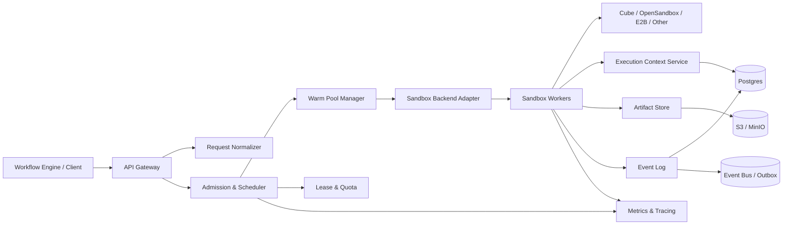

# FlowSandbox：企业级工作流沙箱规划

> 文档状态：提案（Proposal）  
> 版本：0.2  
> 更新日期：2026-09-28  
> 仓库：[yushui2022/FlowSandbox](https://github.com/yushui2022/FlowSandbox)

## 1. 文档目的

这份文档定义 FlowSandbox 的产品边界、技术方向、核心数据模型、并发模型、预热策略、快照语义、执行上下文、实施顺序和验收标准。

目标不是马上写完整生产代码，而是把项目拆成可以逐步验证的工程计划。每一个阶段都应该产出可以运行、压测和演示的垂直切片，避免先做一个庞大的“沙箱平台”再寻找真实使用场景。

## 2. 一句话定位

FlowSandbox 是一个面向企业工作流的、有状态的沙箱基础设施：它根据上层提交的节点请求和预热提示调度多个隔离沙箱，把每个节点的执行尝试与快照、执行上下文、产物和失败原因绑定起来，让工作流可以并行执行、检查、回放、分叉、恢复和审计。

它不是另一个通用容器服务，也不是模型训练平台。第一阶段应接入 CubeSandbox、OpenSandbox、E2B 等已有运行时，把差异化放在工作流执行语义、调度和状态管理上。Agent、LLM 或其他自动化客户端只是它的上层消费者，不是沙箱运行的必要依赖。

### 2.1 与 AI 的边界

FlowSandbox 核心不内置 AI 接口，也不要求沙箱配置模型密钥、LLM SDK 或向量数据库。沙箱只提供确定性的基础设施能力：

- 隔离执行
- 模板和依赖预热
- 并发调度
- 快照、恢复和 fork
- 租约、配额和资源限制
- 事件、产物和执行上下文记录
- 网络、密钥和权限策略

任何外部 Agent、规则分析器或 AI 优化器，都只能通过公开 API 读取事件或申请资源。它们不能绕过控制面直接修改沙箱内部状态。未来如果需要“工作流优化”，应作为独立项目或可选集成，不进入 FlowSandbox 的核心运行时。

### 2.2 与工作流编排器的边界

FlowSandbox 不拥有业务工作流的 DAG 真相，也不负责决定业务节点的顺序、重试条件、Join/Reducer 逻辑或审批结果。它接收上层工作流引擎提交的结构化请求：

```yaml
ExecutionRequest:
  run_id: run_001
  node_id: test_unit
  attempt_id: attempt_003
  template_key: python-test-v3
  command: pytest -q
  resource_profile: medium
  network_policy: restricted
  timeout_seconds: 120
  checkpoint_policy: after_success
  execution_manifest_refs: [execctx_001]
```

如果上层知道未来需要哪些节点，可以显式提交：

```yaml
PrewarmHint:
  template_key: python-test-v3
  expected_count: 20
  ttl_seconds: 300
  deadline: 2026-09-28T08:05:00Z
```

FlowSandbox 负责验证请求、管理预热池、分配 lease、创建或恢复沙箱并报告结果；上层引擎负责 DAG、业务重试、Join、Reducer 和业务状态。

| FlowSandbox 负责 | 上层工作流引擎负责 |
|---|---|
| 沙箱创建、领取、回收和健康检查 | 业务节点顺序和依赖 |
| 模板预热、容量和并发调度 | 重试条件和业务分支 |
| lease、heartbeat、配额和资源隔离 | Join、Reducer 和业务状态 |
| snapshot、restore、fork 和 checkpoint | 审批结果和业务副作用补偿 |
| ExecutionEvent、ArtifactManifest、ExecutionManifest | 自然语言、模型推理和长期记忆 |
| 网络、密钥、出站和执行安全策略 | 业务知识、RAG 和企业知识库 |

## 3. 为什么要做这个项目

企业工作流通常会遇到以下问题：

1. 每个节点都临时启动环境，浏览器、依赖、代码仓库和工具初始化占用大量时间。
2. 一个工作流中的多个节点不能安全地并行，或者只能共享一个不可审计的目录。
3. 一个孤立的 `snapshot_id` 无法回答“它属于哪个工作流、哪个节点、哪次尝试、基于哪个父状态”。
4. 节点失败后只能从头运行，无法从最近的安全检查点重试或分叉。
5. 后续沙箱需要知道上游发生了什么，但直接读取共享卷会造成并发覆盖、脏数据和权限泄露。
6. 节点执行结果、失败原因和产物没有被结构化保存，后续节点和上层工作流引擎无法可靠利用。
7. 支付、邮件、外部数据库写入等副作用无法通过沙箱回滚，企业需要明确的补偿、幂等和审计机制。

FlowSandbox 解决的是“隔离执行环境如何成为工作流的一等执行资源”，而不是单纯降低容器创建耗时，也不是重新实现一个业务工作流引擎。

## 4. 目标用户与典型场景

### 4.1 目标用户

- 企业工作流平台团队
- 批处理、数据处理和代码执行平台团队
- 浏览器自动化和第三方工具执行平台团队
- 企业内部 Agent 平台团队（作为上层客户端）
- 需要运行代码、浏览器、文件和第三方工具的自动化团队
- 低代码/工作流产品团队
- 需要审批、审计和可恢复执行的运维、客服、数据处理团队
- 构建自动化工作流、内部任务编排系统或 Agent 应用的开发者

### 4.2 优先场景

#### 场景 A：浏览器研究与资料汇总

上层工作流引擎拆分出多个检索任务。每个检索节点在独立浏览器沙箱中运行，节点通过执行 manifest 读取输入、产物和错误信息。失败节点的重试决策由上层引擎做出，FlowSandbox 负责从指定 checkpoint 恢复。

#### 场景 B：代码修改、测试和审查

上层工作流引擎准备代码输入，后续节点并行运行单元测试、静态检查和安全扫描。各节点从相同的父快照 fork，产生独立的日志与报告，最终由上层 join 节点读取 manifest 并决定是否合并。

#### 场景 C：企业文档或数据处理

多个节点分别处理文件、抽取字段、校验结果。大文件放在对象存储，沙箱只挂载按 Attempt 限定的目录或读取 URI，避免所有沙箱写入同一份全局文件。

#### 场景 D：需要人工确认的高风险操作

执行节点在沙箱中生成操作计划或待提交文件，FlowSandbox 只负责记录执行状态、产物和 checkpoint。审批、外部写操作和补偿由上层工作流引擎或业务系统负责。

### 4.3 第一阶段不优先支持的场景

- 纯文本问答，不需要执行代码或外部工具
- 只要求快速启动一个短生命周期函数的 Serverless 平台
- 自研通用虚拟机、内核隔离或容器编排系统
- 直接做模型训练、强化学习或基础模型评测平台
- 把 LLM、向量数据库或语义记忆作为沙箱运行时的必选依赖
- 试图一次性支持所有沙箱后端和所有工作流引擎

## 5. 产品边界与非目标

### 5.1 产品目标

1. 让上层工作流引擎可以安全地申请、预热、并行使用和回收大量沙箱。
2. 让每个节点的每次执行都可定位、可审计、可重试、可分叉。
3. 将快照与外部提交的工作流节点、执行尝试、执行上下文和产物绑定，而不是把快照作为孤立资源。
4. 让后续执行节点通过版本化的 ExecutionManifest 读取上游输入、产物、失败状态和 lineage。
5. 为企业提供租户隔离、配额、网络策略、密钥管理、审计和成本统计。
6. 支持先接入已有沙箱后端，再逐步增加后端适配和调度策略。

### 5.2 明确非目标

1. 第一阶段不自研 Firecracker、KVM、容器运行时或 Kubernetes 调度器。
2. 第一阶段不解决外部系统的“真正 exactly-once”。对于邮件、支付和数据库写入，只提供幂等键、side-effect ledger 和补偿接口。
3. 第一阶段不让任何上层客户端直接读写全局共享卷作为执行状态真相。
4. 第一阶段不建立向量记忆、语义记忆或 LLM 优化服务。先把执行事件、上下文、产物和 provenance 做正确。
5. 第一阶段不承诺跨所有后端拥有完全一致的快照语义；差异需要由适配器声明和能力矩阵暴露。

## 6. 核心设计原则

### 6.1 一个项目，三层架构

FlowSandbox 可以作为一个项目实现，但内部必须拆为三层：

- **Control Plane**：请求接入、资源调度、配额、预热、租约、快照血缘和审计。
- **Data Plane**：运行节点命令、浏览器、代码和工具的多个沙箱 Worker。
- **Execution State Plane**：事件、产物、上下文 manifest 和可恢复状态。

“一个沙箱项目”不等于“一个沙箱实例”或“一个共享目录”。

### 6.2 快照只描述运行态，控制面保存执行血缘

快照可以恢复某个时间点的文件系统和运行时状态，但它不能单独描述：

- 该状态属于哪个租户和工作流
- 它是哪个节点的哪次执行尝试
- 它继承了哪个父 Attempt
- 它产生了哪些产物和事件
- 哪些外部副作用已经发生

这些信息必须由 FlowSandbox 控制面使用关系和事件保存；业务工作流的 DAG 和业务状态仍由上层工作流引擎保存。

### 6.3 FlowSandbox 不编排业务节点

FlowSandbox 可以保存 `run_id`、`node_id` 和 `attempt_id` 作为血缘索引，但不根据这些字段自行决定下一个业务节点。它只执行收到的 `ExecutionRequest`，并为上层引擎提供不可变的执行事件、产物 manifest 和恢复引用。

### 6.4 预热由上层提示，容量由沙箱决定

预热池可以根据上层提交的 `PrewarmHint` 提前创建沙箱。FlowSandbox 不需要理解自然语言，也不需要猜测业务分支。它只负责根据模板、资源、区域、策略、TTL 和当前容量决定能否满足提示。

### 6.5 分支和合并属于上层工作流

FlowSandbox 提供 checkpoint fork、独立 lease 和不可变 artifact manifest；多个分支如何合并、是否接受某个结果、是否进入人工审批，由上层工作流引擎决定。

### 6.6 事件是事实，文件系统是物化视图

执行状态变化、工具调用、错误、产物提交和 checkpoint 事件应进入 append-only 事件流或可重放的事件表。共享卷中的日志文件可以作为缓存或物化视图，但不应是唯一真相。

### 6.7 Attempt 使用独立沙箱，合并由上层完成

多个并行 Attempt 不应同时修改一个全局可变目录。它们应拥有独立沙箱和写入目录，并将结果以 artifact manifest 和状态事件的形式提交。最终由上层工作流引擎决定如何合并。

### 6.8 控制面只接受确定性的资源请求

沙箱控制面不解析自然语言，也不调用模型决定是否执行。上层工作流引擎或客户端必须提交结构化的 NodeSpec、ExecutionRequest 和可选的 PrewarmHint；控制面依据版本化策略、配额和租约做确定性的资源调度。

### 6.9 所有写操作都必须可重试

控制面、事件写入、产物提交、沙箱 claim 和 checkpoint 操作都要设计幂等键。企业环境中至少一次投递是常态，不能假设每个请求只会执行一次。

## 7. 总体架构



### 7.1 Control Plane 模块

| 模块 | 责任 | 第一阶段要求 |
|---|---|---|
| API Gateway | 鉴权、租户识别、请求限流 | REST API 即可 |
| Request Normalizer | 校验 NodeSpec、模板、资源和策略字段 | MVP 核心 |
| Admission Controller | 检查配额、权限、资源和网络策略 | 单租户也要保留接口 |
| Scheduler | 为 ExecutionRequest 选择 Worker、模板池和区域 | 支持优先级队列 |
| Warm Pool Manager | 根据 PrewarmHint 管理预热、回收、容量和命中率 | 支持显式预热提示 |
| Attempt Registry/Lifecycle | 登记 Attempt、管理 lease、状态和 snapshot 绑定 | MVP 核心 |
| Lease Manager | 防止重复 claim，处理心跳和过期 | MVP 核心 |
| Execution Context Service | 根据请求中的引用生成 ExecutionManifest | MVP 核心 |
| Artifact Index | 保存产物元数据和血缘 | MVP 核心 |
| Policy Engine | 网络、密钥、资源、暂停/恢复和出站策略 | 先用声明式策略 |
| Audit Service | 审计事件、操作者和外部审批引用 | 第一阶段保存原始事件 |

### 7.2 Data Plane 模块

| 模块 | 责任 |
|---|---|
| Sandbox Worker | 从控制面领取 ExecutionRequest，创建或领取沙箱并执行节点 |
| Backend Adapter | 将统一接口映射到 Cube/OpenSandbox/E2B 等后端 |
| Template Cache | 在 Worker 节点缓存模板和常用依赖 |
| Snapshot Client | 创建、恢复、克隆和查询快照能力 |
| Context Mount | 将 ExecutionManifest 和授权产物以只读方式提供给沙箱 |
| Event Reporter | 发送心跳、任务状态、进程输出和错误事件 |
| Artifact Uploader | 上传产物并提交不可变 manifest |

### 7.3 Execution State Plane 模块

| 模块 | 第一阶段设计 |
|---|---|
| Run Context | Run、NodeRun 和 Attempt 的执行元数据 |
| Execution Events | task/process 状态、输出、错误、暂停和 checkpoint |
| Artifact Store | 输出文件、日志、截图、报告和大文件 |
| ExecutionManifest | 当前节点所需的输入、上游输出、产物 URI、策略版本和 lineage |
| External Event Export | 可选地向外部系统导出事件，不进入沙箱核心运行时 |

## 8. 核心领域模型

### 8.1 对象关系

下面的对象用于保存执行血缘，不代表 FlowSandbox 接管了业务工作流编排。`WorkflowRun`、`NodeRun` 和 `Attempt` 可以由上层传入，也可以由 FlowSandbox 为执行请求登记；业务流程的权威状态仍由上层工作流引擎维护。

```text
Tenant
  └─ WorkflowDefinition
       └─ WorkflowRun
            └─ NodeRun
                 └─ Attempt
                      ├─ SandboxLease
                      ├─ SnapshotRef
                      ├─ ExecutionManifest
                      ├─ ArtifactManifest
                      ├─ ExecutionEvents
                      └─ SideEffectRecords
```

### 8.2 Workflow Reference

FlowSandbox 不保存业务工作流的 DAG 作为唯一真相。它只保存上层工作流引擎传入的引用和节点执行规格，用于调度、血缘和审计。

建议字段：

```text
workflow_ref
tenant_id
workflow_version
source_system
definition_digest
```

NodeSpec 至少包含：

```text
node_ref
node_type
executor_type
command
image_digest
template_key
resource_profile
network_policy
secret_profile
timeout_seconds
checkpoint_policy
side_effect_class
idempotent
parallelizable
input_schema
output_schema
```

`retry_policy`、`edges`、Join、Reducer、审批和业务副作用规则由上层工作流引擎保存和解释。FlowSandbox 只保存必要的引用，不据此编排下一个节点。

### 8.3 WorkflowRun

一次具体的工作流运行。

```text
run_id
tenant_id
workflow_definition_id
workflow_version
status: queued | running | waiting_approval | succeeded | failed | cancelled
input_manifest
priority
budget
created_at
deadline
```

### 8.4 NodeRun

工作流图中某个节点在某次 Run 中的实例。

```text
node_run_id
run_id
node_id
status
dependency_status
active_attempt_id
attempt_count
expected_template_key
output_manifest_id
```

### 8.5 Attempt

Attempt 是项目最重要的执行语义对象。一次重试、人工修正或分支都必须产生新的 Attempt，而不是覆盖原记录。

```text
attempt_id
node_run_id
attempt_number
parent_attempt_id
fork_reason
status: pending | claimed | running | checkpointed | succeeded | failed | cancelled
sandbox_id
snapshot_ref
execution_manifest_id
artifact_manifest_id
error_code
error_summary
started_at
finished_at
idempotency_key
```

### 8.6 SnapshotRef

不要把快照设计成只有一个 ID。建议使用结构化引用：

```yaml
backend: cube
template_digest: sha256:...
snapshot_digest: sha256:...
parent_snapshot_digest: sha256:...
source_attempt_id: attempt_123
source_node_run_id: node_run_456
runtime_config_digest: sha256:...
filesystem_digest: sha256:...
created_at: 2026-09-28T08:00:00Z
capabilities:
  filesystem_restore: true
  runtime_state_restore: true
  network_state_restore: false
  process_restore: false
```

其中 `capabilities` 很重要，因为不同后端对内存、进程、网络连接和挂载卷的快照语义并不相同。

### 8.7 ExecutionManifest

ExecutionManifest 是沙箱和执行器理解上游执行情况的入口。它只描述执行上下文，不承载语义记忆。

```yaml
manifest_id: execctx_123
version: 7
run_id: run_001
node_run_id: node_002
parent_attempts:
  - attempt_id: attempt_001
    status: succeeded
    output_summary: ...
    artifacts:
      - artifact_id: artifact_001
        uri: s3://flowsandbox/runs/run_001/artifacts/result.json
        sha256: ...
  - attempt_id: attempt_003
    status: failed
    error_code: BROWSER_TIMEOUT
    error_summary: ...
constraints:
  remaining_budget: 3
  timeout_seconds: 120
  network_policy: restricted
```

ExecutionManifest 应该有版本号、哈希和提交者。节点读取固定版本，避免执行过程中上下文悄悄变化。任何外部知识或记忆系统只能通过明确的扩展字段或只读挂载接入，不能改变核心执行状态。

## 9. 快照、预热和执行尝试语义

### 9.1 三类快照

#### A. 模板快照

包含运行时、依赖、浏览器、常用工具和基础配置，用于进入 Warm Pool。

例子：

```text
python-browser:v3
node-playwright:v2
python-data-processing:v1
```

#### B. 节点 checkpoint

表示某个 Attempt 在安全边界上的运行状态。常见边界：

- 节点开始前
- 下载或修改代码之后
- 高风险工具调用之前
- 关键步骤成功之后
- 人工审批之前

#### C. Fork snapshot

从父 Attempt 的 checkpoint 创建多个子 Attempt。每个分支拥有独立的沙箱和写入目录。

### 9.2 快照不覆盖的内容

快照不能自动撤销以下操作：

- 发邮件
- 支付或退款
- 修改外部数据库
- 调用第三方 API 产生不可逆业务状态
- 发布消息或创建工单

这些操作如果需要审计，应由上层业务系统或外部副作用记录服务保存引用。FlowSandbox 只记录请求摘要和外部引用，不承担业务补偿。

如果需要保留引用，可使用以下扩展字段；这些字段不用于让 FlowSandbox 执行业务补偿：

```text
external_effect_ref
attempt_id
effect_type
idempotency_key
request_hash
external_reference
status
created_at
```

### 9.3 Attempt 生命周期

```text
pending
  -> claimed
  -> running
  -> checkpointed
  -> succeeded

running -> failed -> terminal
running -> paused
running -> cancelled
```

每次状态变化都写入事件，不直接覆盖历史。上层工作流引擎可以基于事件重新提交新的 Attempt，但 FlowSandbox 不自行决定重试或分支。

## 10. 共享卷与上下文存储设计

### 10.1 推荐的存储分层

| 数据 | 首选存储 | 原因 |
|---|---|---|
| Attempt、租约、状态、权限 | Postgres | 事务、一致性、查询和审计 |
| 队列计数、租约缓存、限流 | Redis | 低延迟和 TTL |
| 执行事件 | Postgres Outbox，后续可接 NATS/Redpanda | 可重放、可靠投递 |
| 日志、报告、大文件 | S3/MinIO | 成本低、不可变 URI、适合并发读取 |
| 模板层和依赖缓存 | 节点本地盘/共享卷 | 降低重复下载 |
| 当前 Attempt 的临时文件 | 按 Attempt 隔离的目录 | 只服务于本次执行 |
| 外部事件导出 | 可选外部系统 | 只导出事件和 manifest，不进入沙箱核心 |

### 10.2 共享卷目录约定

如果后端必须挂载共享卷，建议使用不可重用的 Attempt 目录：

```text
/flowsandbox/
  tenants/{tenant_id}/
    runs/{run_id}/
      nodes/{node_id}/
        attempts/{attempt_id}/
          input/
          work/
          output/
          events/
          manifest.pending.json
          manifest.committed.json
```

规则：

1. 目录由 Attempt 独占，不能让多个并行 Attempt 写同一个 `work/`。
2. 大文件完成后上传对象存储，卷中只保留缓存或索引。
3. manifest 先写临时文件，再原子重命名为 committed 版本。
4. 控制面数据库中的提交事件才是最终状态。
5. 清理必须依据租约、TTL 和引用计数，不能仅依据目录时间。

### 10.3 为什么不把共享卷当成执行状态数据库

共享卷适合保存文件，不适合承载跨节点的执行状态。它缺少：

- 版本和冲突解决
- 事务和条件更新
- 租户级 ACL
- 过期和删除策略
- 事件订阅
- 对不同工作流的隔离

因此，其他沙箱应读取 Execution Context Service，Execution Context Service 再决定读取数据库、事件和对象存储。外部系统如何解释这些执行数据，不由 FlowSandbox 决定。

## 11. 执行上下文与外部系统边界

### 11.1 FlowSandbox 内部保存什么

FlowSandbox 内部只保存让执行可以继续、恢复和审计所需的数据：

- 节点输入和输出
- 上游节点状态
- 产物 URI、哈希和类型
- 运行时、模板和策略版本
- 错误码、错误摘要和重试原因
- checkpoint 和 snapshot lineage
- lease、配额和资源使用情况
- 网络、密钥和审批状态

### 11.2 外部系统如何读取

上层工作流引擎、自动化平台、审计系统或可选的离线分析器，可以订阅事件或读取 ExecutionManifest：

- 它们不能直接改写 Attempt 状态。
- 它们不能把外部分析结果直接写成业务事实。
- 它们不能绕过租约和权限直接接管沙箱。
- 它们如果需要修改工作流，应通过上层工作流引擎创建新版本。

FlowSandbox 只负责提供稳定的执行证据和结构化接口。

### 11.3 可选扩展：External Event Export

如果企业已有审计、成本分析、数据血缘或离线分析系统，可以增加只读事件导出 Adapter：

- Adapter 消费 `ExecutionEvent` 和 artifact manifest。
- Adapter 将数据写入外部系统，而不是写入 FlowSandbox 数据库。
- Adapter 可以计算统计、报表或优化建议，但不能直接修改 Attempt 或池状态。
- Adapter 出现故障时，沙箱执行仍然可以继续。

这保证了“沙箱是沙箱”：它提供隔离和执行基础设施，而不是变成 Agent 平台、记忆平台或工作流优化器。

## 12. 预热系统设计

### 12.1 TemplateKey

预热池不能只按镜像名称划分。建议使用：

```text
template_key =
  runtime_digest
  + dependency_lock_digest
  + browser_version
  + region
  + resource_profile
  + network_policy
  + secret_profile
```

不同网络策略、密钥范围或资源规格不应混用同一预热沙箱。

### 12.2 Warm Pool 状态

```text
requested -> provisioning -> ready -> claimed -> running
ready -> expiring -> recycled
ready -> unhealthy -> destroyed
```

Warm Pool 需要记录：

- ready 数量
- claimed 数量
- 预热命中率
- 平均空闲时间
- 初始化失败率
- 模板版本和依赖哈希
- 单个沙箱成本

### 12.3 预热策略

#### 静态预热

上层工作流引擎或平台管理员在发布时提交模板预热计划。FlowSandbox 只负责按照模板、区域、资源和 TTL 创建预热池。

#### 显式节点预热

上层工作流引擎在某个节点即将完成时提交后续节点的 `PrewarmHint`。FlowSandbox 不需要理解 DAG，也不自行推测下一个节点。

#### 批量预热

上层平台一次提交同一模板的数量、截止时间和 TTL，适合批量任务和扇出执行。

#### 反应式补偿

FlowSandbox 根据等待队列、池中 ready 数量、资源配额和后端健康度补足容量，但不改变业务节点顺序或分支决策。

### 12.4 预热控制循环

```text
每 5 秒执行一次：
  1. 读取各 template_key 的 PrewarmHint、等待队列、ready 数量和 TTL
  2. 根据请求数量、截止时间、资源配额和后端容量计算目标 ready 数量
  3. 检查模板 digest、网络策略和密钥 profile 是否仍然有效
  4. 创建缺口沙箱
  5. 回收超出 TTL、版本过期或不健康的沙箱
  6. 如果预热失败，降低该模板的并发预热速率并记录原因
```

### 12.5 预热的边界

预热不应只启动 VM 或容器。真正需要测量的是应用 readiness：

- Python/Node 解释器是否可用
- 浏览器是否已经启动
- npm/pip 依赖是否完成解析
- Git 仓库或数据集是否已缓存
- 需要的工具服务是否可连接
  - 必要的工具链、SDK 或数据集是否已加载

## 13. 高并发与并行执行设计

### 13.1 两级队列

至少区分：

- 交互队列：用户正在等待结果，低延迟、短任务优先
- 批处理队列：后台批量运行，追求吞吐和成本

后续可以增加租户权重、工作流优先级和截止时间调度。

### 13.2 资源池不是“每个工作流一批沙箱”

不建议为每个工作流预留固定的 100 个沙箱。更好的方式是共享池：

```text
template × region × resource × policy
```

工作流只在需要时 claim，运行结束后归还或销毁。这样可以提升池的整体命中率，减少空闲成本。

### 13.3 分支并行

```text
Parent Attempt checkpoint
        ├─ Fork Attempt A -> Sandbox A
        ├─ Fork Attempt B -> Sandbox B
        └─ Fork Attempt C -> Sandbox C
                         ↓
                    Join / Reducer
                         ↓
                  New ExecutionManifest
```

分支只共享父快照和只读上下文，不能共享可变的工作目录。Join 节点必须定义冲突策略：

- 结果按 key 合并
- 产物按优先级选择
- 多份结果全部保留，由上层工作流引擎或业务系统决策
- 出现冲突时进入人工审批

### 13.4 容量估算

初步使用 Little's Law：

```text
所需并发槽位 ≈ 到达率 × 平均执行时长 × 突发系数 + 保留容量
```

例如每秒 20 个节点、平均执行 5 秒、突发系数 1.5，需要约 150 个并发执行槽位。实际容量还要考虑：

- 模板类型分布
- 单个沙箱 CPU、内存和出网限制
- 浏览器和依赖加载时间
- Worker 节点数量
- 对象存储和事件系统吞吐
- 租户公平性

### 13.5 必要的并发控制

- 幂等 claim：同一个 `attempt_id` 只能有一个有效 lease。
- Lease TTL：Worker 失联后自动释放或进入恢复流程。
- Heartbeat：运行态、资源用量和最后事件时间。
- Backpressure：池耗尽时排队、降级冷启动或返回明确的容量错误。
- Fair Share：单租户不能占满整个模板池。
- 批量 claim：降低每个沙箱一次 RPC 带来的调度开销。
- 分区调度：按 region、template 和 tenant 分片。

## 14. API 规划

第一阶段可以使用 REST，内部事件使用事务 Outbox。后续高吞吐场景再增加 gRPC。

### 14.1 核心 API

```text
POST /v1/workflow-runs
GET  /v1/workflow-runs/{run_id}
POST /v1/execution-requests
POST /v1/prewarm-hints
POST /v1/node-runs/{node_run_id}/attempts
POST /v1/attempts/{attempt_id}/claim
POST /v1/attempts/{attempt_id}/heartbeat
POST /v1/attempts/{attempt_id}/checkpoint
POST /v1/attempts/{attempt_id}/fork
POST /v1/attempts/{attempt_id}/commit
POST /v1/attempts/{attempt_id}/cancel
GET  /v1/attempts/{attempt_id}/execution-manifest
GET  /v1/attempts/{attempt_id}/events
GET  /v1/attempts/{attempt_id}/artifacts
POST /v1/attempts/{attempt_id}/pause
POST /v1/attempts/{attempt_id}/resume
GET  /v1/pools/{template_key}/metrics
```

### 14.2 关键操作语义

#### SubmitExecutionRequest

输入：`run_id`、`node_id`、`attempt_id`、`template_key`、命令或 entrypoint、资源规格、网络策略、ExecutionManifest 引用和幂等键。

输出：登记后的 `attempt_id`、排队状态和预计资源信息。

#### SubmitPrewarmHint

输入：`template_key`、期望数量、TTL、截止时间、区域和资源规格。

输出：预热请求 ID、当前 ready 数量和预计可用数量。

#### AcquireSandbox

输入：已登记的 `attempt_id` 或 ExecutionRequest、`template_key`、资源规格、网络策略、幂等键。

输出：`sandbox_id`、`lease_id`、`snapshot_ref`、`execution_manifest_id`。

#### Checkpoint

输入：`attempt_id`、checkpoint 原因、运行时状态摘要、文件系统摘要。

输出：不可变的 `snapshot_ref` 和新的事件版本。

#### Fork

输入：父 `attempt_id`、子 Attempt 的外部引用、每个子请求的模板和策略。

输出：多个子 `attempt_id`、对应的父快照引用和执行 manifest 版本。

#### Commit

输入：状态、`artifact_manifest`、执行输出摘要、可选 side effect 引用、幂等键。

要求：事件、manifest 索引和状态更新必须可重试，不能出现“文件已上传但 Attempt 仍显示运行中”的无记录状态。

#### GetExecutionManifest

输入：`node_run_id`、执行 manifest 版本或事件游标。

输出：上游节点结果、失败原因、产物 URI、资源预算、策略版本和 lineage。

## 15. 事件模型

建议每个事件至少包含：

```yaml
event_id: evt_001
event_type: attempt.started
tenant_id: tenant_001
run_id: run_001
node_run_id: node_002
attempt_id: attempt_003
sequence: 18
occurred_at: 2026-09-28T08:00:00Z
producer: sandbox-worker-7
payload: {}
causation_id: evt_000
idempotency_key: attempt_003:started
```

建议事件类型：

```text
workflow.created
workflow.started
node.ready
attempt.created
attempt.claimed
attempt.started
task.started
process.exec
process.completed
artifact.uploaded
checkpoint.created
execution.paused
execution.resumed
attempt.failed
attempt.retry_scheduled
attempt.forked
attempt.committed
attempt.cancelled
workflow.completed
```

## 16. 后端适配器设计

定义统一接口，具体后端通过 Adapter 实现：

```text
create_from_template(template_key, policy)
claim_warm(template_key, policy)
start(sandbox_id)
exec(sandbox_id, command, timeout)
checkpoint(sandbox_id)
restore(snapshot_ref)
fork(snapshot_ref, count)
mount_context(sandbox_id, context_ref, mode)
collect_usage(sandbox_id)
stop(sandbox_id)
destroy(sandbox_id)
```

每个后端必须声明能力矩阵：

```text
filesystem_snapshot
runtime_state_snapshot
process_restore
network_restore
clone
read_only_mount
persistent_volume
resource_usage
```

适配器不能隐藏后端差异。控制面发现能力不足时，应选择降级路径或拒绝执行，而不是假装支持完整恢复。

## 17. 安全与企业能力

### 17.1 租户隔离

- 每个资源带 `tenant_id`，控制面所有查询必须带租户条件。
- 模板缓存、产物 URI、执行上下文和日志按租户隔离。
- 不允许跨租户复用带敏感数据的 checkpoint。
- 共享卷目录和对象存储前缀都必须包含租户标识。

### 17.2 网络策略

每个 Node 都要声明出网策略：

```text
none
allowlist
tenant_proxy
full_egress
```

高风险外部操作应由上层工作流引擎或业务代理审批，不能让执行节点通过任意出网绕过控制面。

### 17.3 密钥

- 沙箱内只注入当前节点需要的短期凭证。
- 凭证不写入模板快照或共享卷。
- 日志和事件中需要自动脱敏。
- 失败重试时重新申请凭证，不直接复用失效 token。

### 17.4 执行能力

命令、进程、浏览器和挂载能力应该绑定到 Node Policy，而不是绑定到整个工作流。需要记录：执行者、命令摘要、返回摘要、耗时、退出码和产物引用。业务审批不在 FlowSandbox 内部完成，只提供 pause/resume 和审计事件。

## 18. 可靠性与恢复

### 18.1 Worker 失联

1. Lease 到期后，Attempt 进入 `worker_lost`。
2. 控制面保留最后 checkpoint 和已提交事件。
3. FlowSandbox 返回可恢复的 checkpoint 引用，由上层工作流引擎决定是否提交新的 Attempt。
4. 如果存在未确认的外部副作用，FlowSandbox 只保留引用和未知状态，不替业务系统做补偿决定。
5. 原 Attempt 保留，不覆盖为新结果。

### 18.2 重复事件

通过 `event_id`、`sequence` 和 `idempotency_key` 去重。重复的 `attempt.started` 不应增加 Attempt 计数，也不应覆盖首次启动时间。

### 18.3 部分提交

Commit 操作采用：

1. 上传产物。
2. 计算哈希并写入 artifact manifest。
3. 写入 outbox 事件。
4. 在事务中更新 Attempt 状态和 manifest 引用。
5. 异步发布事件。

如果步骤中断，后台 reconciler 根据 manifest、事件和 Attempt 状态进行修复。

### 18.4 超时和取消

超时需要区分：

- 沙箱创建超时
- 应用 readiness 超时
- 单条命令超时
- 节点总执行超时
- 工作流总预算耗尽

取消操作要写入控制面，并向 Worker 发送取消信号。仅关闭客户端连接不能视为取消成功。

## 19. 观测与运营指标

### 19.1 延迟指标

- API P50/P95/P99
- Admission queue time
- Warm claim time
- Cold start time
- Application readiness time
- ExecutionManifest read latency
- Artifact upload latency
- Checkpoint latency
- Fork latency

### 19.2 资源指标

- Warm hit rate
- Ready/claimed/running/unhealthy 数量
- Worker CPU、内存、磁盘和网络
- 每个模板的空闲时长
- 每个租户的沙箱分钟数
- 每次 Attempt 成本
- 预热浪费率

### 19.3 正确性指标

- 重复 Attempt 数量
- 事件丢失或乱序数
- ExecutionManifest 版本冲突
- artifact manifest 不完整数
- checkpoint 恢复成功率
- 重试后成功率
- 外部副作用未确认数

## 20. 技术栈建议

### 20.1 MVP 推荐

| 层 | 建议 |
|---|---|
| Control Plane | Python + FastAPI + SQLAlchemy/asyncpg |
| 数据库 | PostgreSQL |
| 租约和限流 | Redis |
| 事件 | PostgreSQL Outbox，先不引入复杂消息系统 |
| 大文件 | MinIO 或兼容 S3 的对象存储 |
| Sandbox Backend | 先选一个：CubeSandbox、OpenSandbox 或 E2B |
| 本地开发 | Docker Compose |
| 观测 | OpenTelemetry + Prometheus + Grafana |
| API 文档 | OpenAPI |

### 20.2 后续扩展

- 事件量上升后接 NATS JetStream、Redpanda 或 Kafka。
- 多 Worker 和多区域后增加独立 Scheduler。
- 对象存储规模上升后增加生命周期规则和分层存储。
- 需要更严格隔离时再评估 Kubernetes Agent Sandbox、gVisor 或 Firecracker 后端。

不要在 MVP 同时引入 Postgres、Redis、Kafka、Temporal、Kubernetes、向量库和多个沙箱后端。每个新增基础设施都要有明确的吞吐或可靠性需求。

## 21. 仓库规划

建议逐步形成以下结构：

```text
FlowSandbox/
├─ docs/
│  ├─ FlowSandbox-企业级工作流沙箱规划.md
│  ├─ architecture.md
│  ├─ api.md
│  ├─ adr/
│  └─ benchmarks/
├─ apps/
│  ├─ api/
│  └─ worker/
├─ packages/
│  ├─ domain/
│  ├─ execution-context/
│  ├─ sandbox-adapters/
│  ├─ artifacts/
│  ├─ policy/
│  └─ observability/
├─ services/
│  ├─ scheduler/
│  ├─ warm-pool/
│  └─ reconciler/
├─ migrations/
├─ examples/
│  ├─ parallel-code-review/
│  ├─ browser-research/
│  └─ approval-workflow/
├─ tests/
│  ├─ unit/
│  ├─ contract/
│  ├─ integration/
│  ├─ load/
│  └─ chaos/
├─ deploy/
│  ├─ docker-compose/
│  └─ kubernetes/
└─ pyproject.toml
```

第一阶段可以只创建 `apps/api`、`apps/worker`、`packages/domain`、`packages/execution-context`、`packages/sandbox-adapters`、`migrations` 和 `examples`，不要一开始创建空的微服务目录。

## 22. 分阶段实施计划

### Phase 0：决策与基线（1 周）

目标：完成最小技术路线和可运行环境，明确 FlowSandbox 只执行上层提交的请求。

任务：

- 选择一个沙箱后端。
- 明确一个外部工作流引擎或脚本驱动的示例：提交执行请求、预热提示、并行 Attempt 和恢复请求。
- 建立 Postgres、Redis、对象存储的本地 Compose 环境。
- 定义 ExecutionRequest、PrewarmHint、Attempt、SnapshotRef、ExecutionManifest schema。
- 建立 ADR：后端选择、事件一致性、共享卷边界、快照能力矩阵。

验证：

- 能从外部客户端提交 ExecutionRequest 和 PrewarmHint。
- 能在数据库中登记 NodeRun、Attempt 和 sandbox lease。
- 所有资源都带 tenant_id、run_id 和版本。

真实风险：

- 如果后端快照 API 不支持需要的 clone/restore 语义，必须在本阶段暴露，而不是等到并行开发后才发现。

### Phase 1：最小垂直切片（2–3 周）

目标：完成一次“创建沙箱 → 执行节点 → 上传产物 → 记录事件 → 成功结束”的闭环。

任务：

- 实现 API Gateway 和 Attempt Registry/Lifecycle。
- 实现一个 Sandbox Adapter。
- 实现 Worker claim、heartbeat 和 lease 过期。
- 实现 Execution Event 和 Artifact Manifest。
- 实现 ExecutionManifest 的生成和只读注入。
- 实现按 Attempt 的临时目录。

验收：

- 一个外部客户端可以连续提交三个 ExecutionRequest。
- Worker 掉线后 Attempt 不会永久卡在 running。
- 重复发送 commit 不会生成重复产物或重复成功事件。
- 可以通过 Attempt ID 查看完整执行链路。

### Phase 2：预热和单工作流并行（2–3 周）

目标：证明显式预热提示和多个沙箱并行确实降低执行延迟。

任务：

- 实现 Warm Pool Manager。
- 实现模板 digest 和池容量目标。
- 实现 PrewarmHint、批量 claim 和 TTL 回收。
- 实现父 checkpoint 到多个子 Attempt 的 fork。
- 验证上层客户端可以读取多个不可变 artifact manifest；Join/Reducer 保留在示例客户端。
- 增加交互队列、批处理队列和基础配额。

验收：

- 一个父节点能并行启动至少 10 个子沙箱。
- 分支之间不能读取或修改彼此的 work 目录。
- 在固定负载下，warm-start 的 P95 明显低于 cold-start。
- 预热池耗尽时可以排队或冷启动，不丢失 Attempt。

### Phase 3：恢复、审批和企业安全（3–4 周）

目标：让系统可以处理真实失败、租约丢失和企业安全边界。

任务：

- 增加 checkpoint 策略和恢复。
- 增加外部副作用引用、幂等键和 pause/resume 审计 hook；补偿由业务系统负责。
- 增加网络出口策略和短期密钥注入。
- 增加暂停、恢复和外部审批引用，不在沙箱内实现业务审批节点。
- 增加审计查询和租户隔离测试。

验收：

- Worker 崩溃后可从最近 checkpoint 恢复。
- 外部副作用有明确的已确认或未知状态，并能追溯到 Attempt。
- 非授权租户无法读取事件、产物、快照和执行上下文。
- 出网策略在沙箱内可被验证，而不是只存在数据库里。

### Phase 4：多租户、资源治理和调度扩展（4–6 周）

目标：把单租户垂直切片扩展成可以承载企业并发的沙箱基础设施。

任务：

- 增加租户级配额、优先级和公平调度。
- 增加模板、区域、资源和网络策略维度的池分片。
- 增加节点本地模板缓存和批量 claim。
- 增加存储生命周期、产物清理和成本统计。
- 增加第二个 Sandbox Adapter，验证能力矩阵和降级路径。

验收：

- 多租户突发流量不会让单个租户占满整个模板池。
- 不同后端的 snapshot/fork 能力差异可以被检测和暴露。
- 预热策略的成本、命中率和回收率可比较。
- 对象存储、共享卷和数据库的生命周期不会无限增长。

### Phase 5：多后端、多区域和生产化（后续）

目标：支持不同隔离后端和地域的统一调度。

任务：

- 完成更多 Sandbox Adapter，并维护后端能力矩阵和兼容性检查。
- 按区域和模板分片 Scheduler。
- 支持跨区域的 Artifact 和 ExecutionManifest 访问策略。
- 建立成本感知调度。
- 增加灾备、跨区域故障转移和生产升级策略。

## 23. 测试与验证计划

### 23.1 单元测试

- ExecutionRequest 字段和策略校验
- Attempt 状态机
- SnapshotRef 兼容性检查
- ExecutionManifest 版本和引用校验
- 租约续期和过期
- 幂等键和重复事件去重
- 预热目标数量计算
- 配额和优先级决策

### 23.2 合约测试

每个 Sandbox Adapter 必须通过同一组测试：

- 创建模板沙箱
- 执行命令
- 上传和读取产物
- 创建 checkpoint
- restore/fork
- 应用 readiness
- 强制终止和回收
- 查询资源用量

### 23.3 集成测试

至少覆盖：

1. 外部客户端连续提交三个 ExecutionRequest。
2. 一个 Attempt 失败后，上层提交新的恢复 Attempt。
3. 一个父 Attempt fork 出 10 个独立子 Attempt。
4. 外部客户端读取多个不可变 artifact manifest。
5. Worker 中途断开连接。
6. 对象存储上传成功但数据库事务失败。
7. 两个 Worker 同时 claim 同一个 Attempt。
8. 一个租户耗尽配额，其他租户仍能执行。

### 23.4 压测矩阵

| 场景 | 并发 | 重点指标 |
|---|---:|---|
| 单模板冷启动 | 10 | P50/P95 启动时间 |
| 单模板预热命中 | 50 | claim 延迟、命中率 |
| 多模板混合 | 100 | 调度公平性、池碎片 |
| Attempt 扇出 | 100 | fork、对象存储和 manifest 吞吐 |
| 多租户突发 | 500 | 队列、配额和 backpressure |
| Worker 故障 | 100 | 恢复时间、重复执行 |

建议重点记录：

```text
warm_hit_rate
queue_wait_p95
claim_p95
app_ready_p95
execution_manifest_read_p95
checkpoint_p95
fork_p95
artifact_commit_p95
retry_success_rate
cost_per_attempt
```

### 23.5 故障注入

- 杀掉 Worker 进程
- 延迟或拒绝快照 API
- 模拟对象存储不可用
- 模拟共享卷断开
- 事件重复、乱序和延迟
- 网络策略错误
- 租约续期失败
- 模板版本在预热过程中变更

## 24. 成功标准

### MVP 成功标准

- 能被外部客户端驱动，完成串行请求、并行 Attempt、checkpoint 和恢复。
- 每个 Attempt 都有明确的父关系、快照引用、上下文版本和产物 manifest。
- 10 个并行分支不会互相覆盖工作目录。
- Worker 失联后能检测并恢复或明确失败。
- 预热、冷启动、排队和回收都有可观测指标。
- 能解释一次失败：哪个节点、哪次尝试、使用哪个沙箱、基于哪个快照、读取了哪些上下文、产生了哪些副作用。

### 企业试点成功标准

- 至少支持一个真实企业工作流或自动化执行场景。
- 支持多个租户或多个业务空间的隔离。
- 能够配置出网、密钥和人工审批策略。
- 运行历史可以审计和导出。
- 预热成本、并发上限和失败恢复时间可量化。
- 不依赖开发者手工登录沙箱修复状态。

## 25. 主要风险与应对

| 风险 | 表现 | 应对 |
|---|---|---|
| 把共享卷当数据库 | 并发覆盖、脏读、回滚不一致 | 事件和数据库为真相，卷只做缓存/只读挂载 |
| 快照能力不一致 | 不同后端恢复结果不同 | 能力矩阵、版本和适配器降级 |
| 外部副作用不可回滚 | 回滚沙箱但邮件或支付已发生 | 记录外部引用和幂等键，补偿由业务系统负责 |
| 预热成本过高 | 大量空闲沙箱浪费 | TTL、按模板池、预测和限额 |
| 模板缓存污染 | 一个租户或旧版本影响其他执行 | digest、租户策略、不可变模板 |
| 调度器成为瓶颈 | 沙箱本身很快但排队很慢 | 分片、批量 claim、异步事件、水平扩展 |
| 执行上下文污染 | 错误产物或旧 manifest 被后续节点读取 | 版本、哈希、租户 ACL、不可变 artifact |
| 租户数据泄露 | 产物、日志或上下文跨租户读取 | 全链路 tenant_id、ACL、加密和合约测试 |
| 过早引入太多基础设施 | 开发周期长、故障面大 | MVP 先用 Postgres Outbox，按指标演进 |
| 只优化沙箱启动 | 应用依赖和浏览器仍然慢 | 测量 application readiness，而非只测 VM 启动 |

## 26. 待决策事项

以下问题应在 Phase 0 结束前写入 ADR：

1. 首个后端选择 CubeSandbox、OpenSandbox 还是 E2B？
2. 首个工作流示例是浏览器研究、代码审查还是数据处理？
3. 是否需要 runtime state snapshot，还是第一阶段只保存文件系统 checkpoint？
4. 共享卷是本地卷、NFS、S3 mount 还是只读对象存储下载？
5. 事件量达到什么阈值后引入 NATS/Redpanda？
6. 哪些外部副作用需要由业务系统记录引用和幂等键？
7. 第一阶段租户模型是单租户但保留字段，还是直接做多租户？
8. 沙箱 Worker 是按 Kubernetes Deployment 运行，还是先用 Docker Compose？
9. 首个客户端是否直接兼容某个现有工作流引擎，还是先使用 FlowSandbox 自有 ExecutionRequest schema？
10. 外部事件导出优先接入审计、成本分析还是数据血缘系统？

## 27. 推荐的第一个演示

建议做一个“并行代码审查工作流”，因为它同时证明了项目的核心价值：

```text
外部工作流引擎提交代码仓库输入
      ↓
父节点：准备代码 + 创建 checkpoint
      ├─ 分支 A：单元测试
      ├─ 分支 B：静态分析
      ├─ 分支 C：依赖漏洞扫描
      └─ 分支 D：生成变更摘要
      ↓
外部 Join：读取并合并 artifact manifests
      ↓
外部审查节点：读取分支结果和失败原因
      ↓
业务系统继续审批或生成最终报告
```

这个演示可以直接展示：

- 一个父快照如何 fork 成多个沙箱
- 多个沙箱如何并行执行
- 每个分支如何保存独立日志和产物
- 外部系统如何通过 manifest 合并
- 外部系统如何提交新的恢复 Attempt
- 审查节点如何通过 ExecutionManifest 了解前面发生了什么

## 28. 最终定位

FlowSandbox 最终应被描述为：

> 一个把外部工作流节点、执行尝试、隔离沙箱、快照、执行上下文和产物连接起来的企业级执行基础设施。

真正的壁垒不是“能启动一个沙箱”，也不是“有一个 snapshot API”，而是：

1. 能否在高并发下正确调度多个沙箱。
2. 能否知道每次执行从哪里来、产生了什么、为什么失败。
3. 能否从安全 checkpoint 快速重试或分叉。
4. 能否让后续节点读取结构化且有权限边界的上下文。
5. 能否控制外部副作用、租户权限和审计。
6. 能否在多个沙箱后端之间保持一致的执行语义。

如果先把这几个问题做成一个可压测的垂直切片，FlowSandbox 就有机会从“沙箱包装器”发展成企业工作流的执行基础设施。

## 29. 参考资料

- [E2B Templates](https://e2b.dev/docs/sandbox/templates)
- [CubeSandbox Templates](https://cubesandbox.com/guide/templates)
- [CubeSandbox Snapshot / Rollback / Clone](https://docs.cubesandbox.com/guide/snapshot-rollback-clone)
- [OpenSandbox](https://github.com/alibaba/OpenSandbox)
- [Kubernetes Agent Sandbox](https://agent-sandbox.sigs.k8s.io/)
- [Temporal Sandbox Orchestration Harness](https://github.com/temporal-community/sandbox-orchestration-harness)
- [ORION：基于 DAG 的 look-ahead 预热研究](https://github.com/icanforce/Orion-OSDI22)


